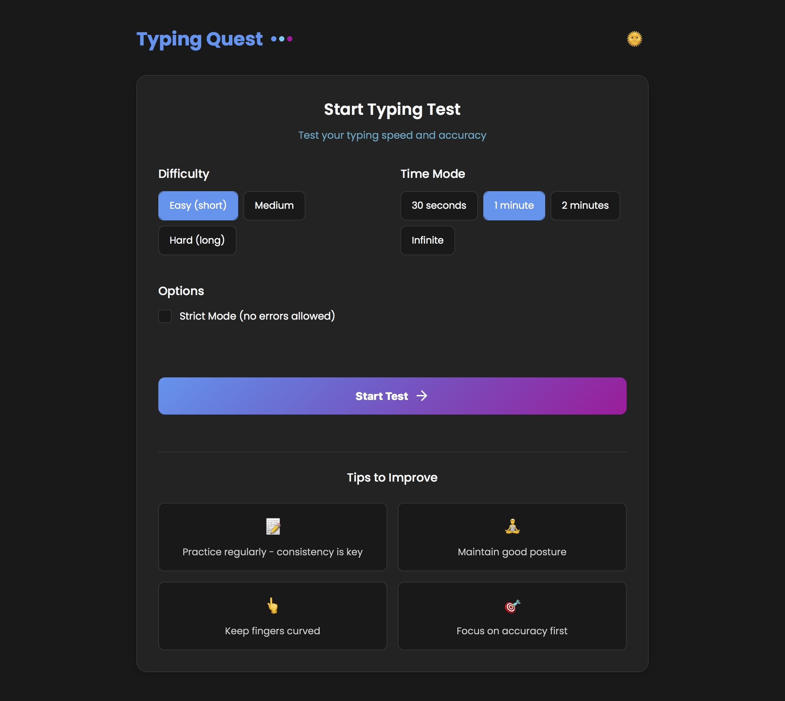

# Typing Quest ⌨️

[](LICENSE)


A modern, minimalist typing speed trainer designed to help you master the keyboard. Built for speed, aesthetics, and focus.

## 🌐 Live Demo

<div align="center">
  <a href="https://typing-quest.netlify.app/">
    
  </a>
  <br>
  <a href="https://typing-quest.netlify.app/">
    
  </a>
</div>

## ✨ Features

- **Modern Engine**: Built with React & Vite for zero-latency typing.
- **Dynamic Themes**: Beautiful Dark/Light modes with animated "Aurora" backgrounds.
- **Flexible Modes**: Race against the clock (15s, 30s, 60s) or relax in infinite Zen Mode.
- **Smart Difficulty**: Choose between Easy, Medium, or Hard text complexity.
- **Mobile Ready**: Fully optimized typing experience for phones and tablets.
- **Real-time Stats**: Instant feedback on WPM and Accuracy as you type.

## 🚀 Getting Started

1. **Clone the repository:**
   ```bash
   git clone [https://github.com/sagarbudhwani/typing-quest.git](https://github.com/sagarbudhwani/typing-quest.git)
   cd typing-quest
   ```

2. **Install dependencies:**
   ```bash
   npm install
   ```

3. **Start the dev server:**
   ```bash
   npm run dev
   ```
## 📂 Project Structure

```bash
typing-quest/
├── src/
│   ├── components/     # UI Components (Layouts, Toggles)
│   ├── hooks/          # Game logic & Theme hooks
│   ├── pages/          # Home, Game, and Results screens
│   └── assets/         # Images and icons
├── public/             # Static assets & redirects
├── index.html          # Entry point
└── tailwind.config.js  # Styling configuration
```

## 🛠 Tech Stack

- **Frontend**: React.js
- **Build Tool**: Vite
- **Styling**: Tailwind CSS
- **Animations**: Framer Motion
- **Icons**: Lucide React

## 📜 License

MIT © [Sagar Budhwani](https://github.com/sagarbudhwani)
